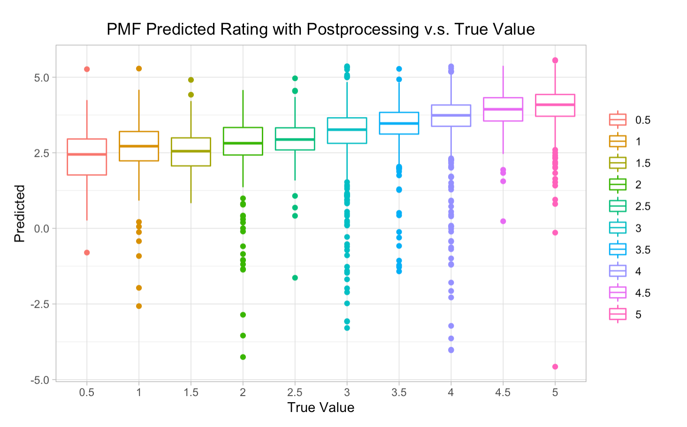

### Step 3 Postprocessing for Probabilistic Gradien Descent  
After matrix factorization, postporcessing will be performed to improve accuracy.  
The referenced papers are:  
  
P2:[Postprocessing SVD with KNN](./paper/P2 Improving regularized singular value decomposition for collaborative filtering .pdf) Section 3.5  
  
```{r message=FALSE}
# p(user) and q(movie)
library(readr)
load("../output/mat_fac_pmf.RData")
data <- read_csv("../data/ml-latest-small/ratings.csv")

p <- result$p
q <- result$q
colnames(p) <- sort(unique(data$userId))
colnames(q) <- sort(unique(data$movieId))
set.seed(0)
test_idx <- sample(1:nrow(data), round(nrow(data)/5, 0))
train_idx <- setdiff(1:nrow(data), test_idx)
data_train <- data[train_idx,]
data_test <- data[test_idx,]
```
  
```{r message=FALSE}
if(!require("lsa")){
  install.packages("lsa")
}
library(lsa)
library(tidyverse)
# cos_mat_q <- cosine(q)
# save(cos_mat_q, file = "../output/cos_pmf.Rdata")
# load("../output/cos_pmf.Rdata")

colnames(cos_mat_q) <- colnames(q)
rownames(cos_mat_q) <- colnames(q)
index <- rep(NA, ncol(cos_mat_q))
for (i in 1:ncol(cos_mat_q)) { # find the index of the nearest neighbor movie
  vec <- cos_mat_q[,i]
  index[i] <- order(vec, decreasing = TRUE)[2]
}

original_rating <- t(q) %*% p # The estimated rating before post processing

mean_rating_knn <- data_train %>% group_by(movieId) %>% summarize(mean_rating_knn = mean(rating)) 
mean_rating_knn$movieId <- as.character(mean_rating_knn$movieId)
knn_rating <- cbind(mean_rating_knn$movieId,mean_rating_knn[index[which(colnames(cos_mat_q)%in%mean_rating_knn$movieId)],2])
# Get the average rating

train_userID <- as.character(data_train$userId)
train_movieID <- as.character(data_train$movieId)
predictor_before <- vector()
knn_predictor <- vector()
for(w in 1:nrow(data_train)){ # extract the predictor for the set before and after postprocessing
  predictor_before <- c(predictor_before, original_rating[train_movieID[w], train_userID[w]])
  knn_predictor <- c(knn_predictor, knn_rating[train_movieID[w],2])
}
y_knn <- data_train$rating
train_knn <- cbind(predictor_before = predictor_before, knn_predictor = knn_predictor, y_knn = y_knn)
train_knn <- na.omit(train_knn)
train_knn <- as.data.frame(train_knn)

knn_model <- lm(y_knn ~ knn_predictor + predictor_before)
```  
  
```{r}
# Calculate the prediction for test set
mean_rating_knn_test <- data_test %>% group_by(movieId) %>% summarize(mean_rating_knn_test = mean(rating)) 
mean_rating_knn_test$movieId <- as.character(mean_rating_knn_test$movieId)
knn_rating_test <- cbind(mean_rating_knn_test$movieId,mean_rating_knn_test[index[which(colnames(cos_mat_q)%in%mean_rating_knn_test$movieId)],2])
# Get the average rating


test_userID <- as.character(data_test$userId)
test_movieID <- as.character(data_test$movieId)
predictor_before_test <- vector()
knn_predictor_test <- vector()
for(r in 1:nrow(data_test)){ # extract the predictor for the set before and after postprocessing
  predictor_before_test <- c(predictor_before_test, original_rating[test_movieID[r], test_userID[r]])
  knn_predictor_test <- c(knn_predictor_test, knn_rating_test[test_movieID[r],2])
  
}
y_knn_test <- data_test$rating

test_knn <- cbind(predictor_before = predictor_before_test, knn_predictor = knn_predictor_test, y_knn = y_knn_test)
test_knn <- na.omit(test_knn)
test_knn <- as.data.frame(test_knn)

```


```{r}
# Calculate test RMSE for KNN
pred_knn_test <- predict(knn_model, test_knn[,-3])
# library(ggplot2)
# ggplot(mapping = aes(x= as.factor(test_knn[,3]), y = pred_knn_test) )+ geom_boxplot(aes(color =as.factor(test_knn[,3]))) + 
# theme_light() + labs(title = "PMF Predicted Rating with Postprocessing v.s. True Value", x = "True Value", y = "Predicted") # + theme(legend.title = element_blank(), plot.title = element_text(hjust = 0.5))
RMSE_adj <- sqrt(mean((test_knn[,3] - pred_knn_test)^2))
cat("The test RMSE of the Probabilistic Gradient Descent with postprocessing is", RMSE_adj) #0.809694
```


  
